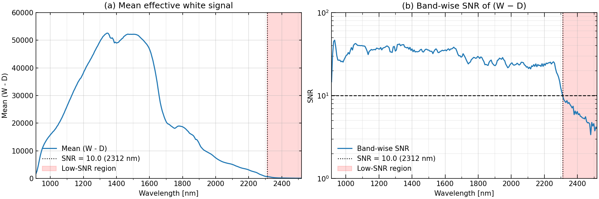

## HSI Reference SNR Inspector

白板（white）/暗電流（dark）リファレンスから、反射率補正の分母 `W - D` の **バンド別SNR** を計算し、低SNR帯（ノイズ増幅の原因になりやすい波長域）を特定するための簡易QCツールです。

反射率補正は一般に

```math
R = \frac{I - D}{W - D}
```

で与えられるため、分母 `W - D` が小さい / 空間的にばらつく波長帯では割り算でノイズが増幅します。本ツールでは各バンドで

- `μ(λ) = mean_pixels(W - D)`
- `σ(λ) = std_pixels(W - D)`
- `SNR(λ) = μ(λ) / (σ(λ) + eps)`

を計算し、`snr_threshold` 以下となる波長帯（nm）をレポートします。

---

### 1. セットアップ

#### 環境構築
```bash
conda env create -f env.yaml
conda activate hsi_snr
```

### 必要ファイル配置

以下のように `data/` 配下へ ENVI 形式（`.hdr` + `.raw`）を置きます。

```
project_root/
  main.py
  env.yaml
  data/
    white.hdr
    white.raw
    dark.hdr
    dark.raw
```

---

### 2. 使い方

#### コマンド例

```bash
python main.py --white_name white --dark_name dark --snr_threshold 10 --eps 1e-12
```

* `--white_name` / `--dark_name` : `data/{name}.hdr`, `data/{name}.raw` を読み込みます（拡張子不要）
* `--snr_threshold` : 低SNR判定の閾値
* `--eps` : `std=0` を避けるための微小量

#### ヘルプ

```bash
python main.py -h
```
#### 出力例

```bash
(hsi_snr) PS D:\NIR-HSI_reference_inspection> python main.py --white_name W --dark_name D --snr_threshold 10 --eps 1e-12       
========================================================================
ENVI Metadata Summary
========================================================================

[Identity]
description        : File generated from Compovision Spectra Measurement
file type         : ENVI
sensor type       : Sumitomo Electric Industries Ltd. CV-N800-HS(16bit/Grey),013CA00007
acquisition date  : DATE(dd-mm-yyyy): 15-12-2025

[Layout / Shape]
interleave        : bil
samples           : 320
lines             : 1
bands             : 256
default bands     : ['63', '78', '93']

[IO / Encoding]
header offset     : 0
data type         : 12
byte order        : 0

[Spectral Axis]
wavelength len    : 256
wavelength stats [nm]  : min=913.10, max=2518.47
Δwavelength stats [nm] : min=6.2500, max=6.3400, mean=6.2956, median=6.3000, std=0.0232

[FWHM]
fwhm len          : 255
fwhm stats [nm]        : min=6.25, max=6.34, mean=6.2956, median=6.3000, std=0.0232

[Other keys]
acquisition date : DATE(dd-mm-yyyy): 15-12-2025
bands            : 256
byte order       : 0
data type        : 12
default bands    : ['63', '78', '93']
description      : File generated from Compovision Spectra Measurement
file type        : ENVI
fps              : 30
header offset    : 0
interleave       : bil
lines            : 1
samples          : 320
sensor type      : Sumitomo Electric Industries Ltd. CV-N800-HS(16bit/Grey),013CA00007
x start          : 0
y start          : 0


========================================================================
SNR inspection (denominator = white - dark)
========================================================================
bands             : 256
wavelength[nm]     : 913.10 .. 2518.47
snr_threshold      : 10.0
snr (all) stats    : min=3.3704, max=46.4755, mean=27.3326, median=28.4935, std=10.4303

low-SNR bands      : count=34 (13.28%), range=[2311.85, 2518.47] nm (idx [222, 255])
snr (low) stats    : min=3.3704, max=9.7680, mean=6.0954, median=5.7504, std=1.6587

low-SNR contiguous ranges [nm] (and idx):
  - [2311.85, 2518.47] nm  (idx [222, 255], len=34)

 plot saved to img\reference_snr.png
```
